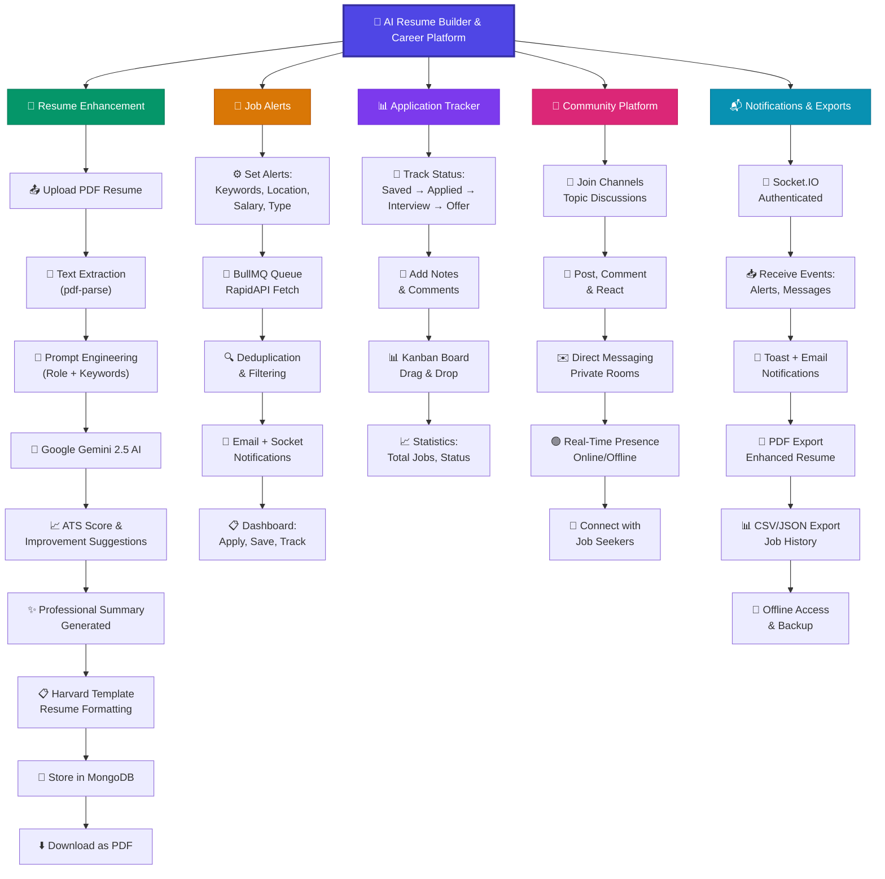

# AI Resume Builder & Career Platform - Architecture Flow

---

## 📋 Feature Overview

### 1. 📄 Resume Enhancement
| Step | Description |
|------|-------------|
| Upload | Upload PDF resume to the platform |
| Extract | Text extraction using pdf-parse library |
| Engineer | Prompt engineering with role & keywords |
| AI Process | Google Gemini 2.5 AI enhancement |
| Score | ATS score & improvement suggestions |
| Summary | Professional summary generation |
| Format | Harvard template formatting |
| Store | Save enhanced resume to MongoDB |
| Download | Export as polished PDF |

### 2. 🔔 Job Alerts
| Step | Description |
|------|-------------|
| Configure | Set keywords, location, salary, job type |
| Fetch | BullMQ queue triggers RapidAPI job fetch |
| Filter | Deduplication & smart filtering |
| Notify | Email + real-time socket notifications |
| Manage | Dashboard for quick apply, save & track |

### 3. 📊 Application Tracker
| Step | Description |
|------|-------------|
| Track | Status flow: Saved → Applied → Interview → Offer/Reject |
| Notes | Add personal notes & comments |
| Kanban | Drag & drop status updates |
| Stats | Overview of total jobs & status distribution |

### 4. 👥 Community Platform
| Step | Description |
|------|-------------|
| Channels | Join topic-based discussion channels |
| Engage | Post, comment & react to content |
| DM | Private direct messaging rooms |
| Presence | Real-time online/offline indicators |
| Network | Connect with fellow job seekers |

### 5. 📬 Notifications & Exports
| Step | Description |
|------|-------------|
| Auth | Authenticated Socket.IO connection |
| Events | Receive job alerts, messages, updates |
| Alerts | Toast notifications + email via Nodemailer |
| PDF | Enhanced resume PDF export |
| Data | CSV/JSON export for job history |
| Backup | Offline access & data backup |

---

## 🛠️ Tech Stack

| Layer | Technologies |
|-------|--------------|
| **Frontend** | React, Vite, Tailwind CSS |
| **Backend** | Node.js, Express |
| **Database** | MongoDB, Firebase Firestore |
| **AI** | Google Gemini 2.5 |
| **Queue** | BullMQ, Redis |
| **Real-time** | Socket.IO |
| **Email** | Nodemailer |
| **APIs** | RapidAPI (Job Search) |
